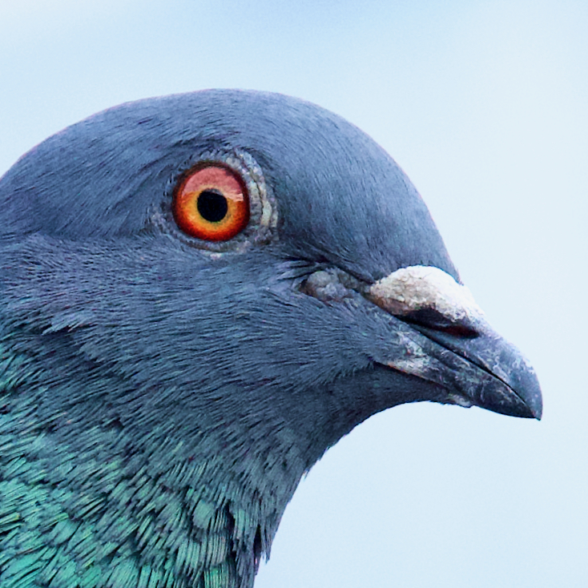

  

<h1 align="center">
  <a href="https://destringers-field-guide.com">Destringers' Field Guide</a>
</h1>

## Overview

Use this guide to lean to help "stringfoot" pigeons that you encounter.

Its goals are to:

- Present destringing as an ethical, practical example of inter-species communication, engagement, and aid.
- Contain all the information needed to take a human from no knowledge of pigeons to destringing them responsibly.
- Help achieve better results for pigeons by prompting you with the answers to questions you might otherwise (completely understandably) ask too late.
- Be easily distributable so that destringers can simply and effectively connect other interested humans to the knowledge they need.
- Evolve over time so that it represents the best possible advice.

## Development

Set up the repo:
- `git clone https://github.com/WestleyArgentum/destringers-field-guide.git`
- `cd destringers-field-guide`
- `npm install`

Run the development server:
- `npm start`

If you change images or something isn't working right:
- `npm run clean`
