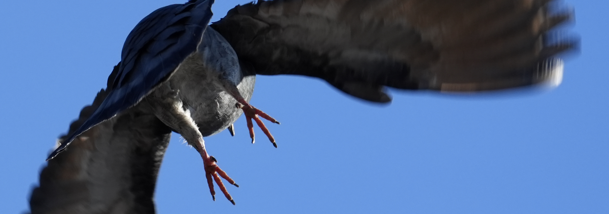

# Introduction

Pigeons and humans have lived together for thousands of years. It hasn't been an overly straightforward, peaceful relationship. We have, at times, provided them with grand homes. Usually we have demanded their feces and flesh in return.

Currently many humans *believe* we have found better fertilizers than their poop and more profitable birds to slaughter. And so now we refer to free pigeons as "feral". Forever altered because of how we forced their ancestors to breed, still largely dependent on humans for food, and generally treated as unwelcome. But free.

Living in proximity to humans, on and in structures we created, and foraging amongst the things we leave laying around the environment, presents a number of challenges. We produce and widely distribute many potent poisons, for instance. Both things intended to kill like pesticides and things that are incidentally deadly like road de-icing salts. If you can do anything to prevent this from happening, please do.

But pigeons also face practical issues related to our garbage. Pigeons have many profoundly amazing abilities but, unfortunately, they cannot carefully manipulate string, hair, etc, that gets wrapped around their feet. Over time, string they can't remove is pulled tighter and tighter until it cuts off circulation and eventually severs toes or feet altogether. As you can imagine, this is often not a clean process and can involve a lot of blood, nasty infections, and agony.

Interfering in the lives of other creatures should never be done lightly. Nature is violent, and through this violence systems of tremendous complexity and resiliency have developed. But predators that depend on pigeons for survival do not depend on them being handicapped. In places where we more carefully manage our trash pigeons simply have fewer disabilities and live better lives.

With a little bit of knowledge and some basic tools anyone can learn to "destring" and help injured pigeons. You can make huge improvements to their quality of life, and even save lives.

If you like spending time with pigeons, and especially if you consistently feed them, consider using this guide and other online resources to learn to help stringfoot pigeons that you encounter.

## Goals of This Field Guide

This guide should:

- Present destringing as an ethical, practical example of inter-species communication, engagement, and aid.
- Contain all the information needed to take a human from no knowledge of pigeons to destringing them responsibly.
- Help achieve better results for pigeons by prompting you with the answers to questions you might otherwise (completely understandably) ask too late.
- Be easily distributable so that destringers can simply and effectively connect other interested humans to the knowledge they need.
- Evolve over time so that it represents the best possible advice.

## Further Learning

Many wonderful resources about destringing and helping pigeons exist out there. Read, watch, and listen widely!

Check these out (and contribute others you know about):
- [Pigeons.biz forum](https://www.pigeons.biz/)
- [Stringfoot Pigeon Help](https://www.stringfootpigeon.com/destring-101.html)
- [Destringing Pigeons: Freeing Feet and Opening Minds](https://www.pigeonrescue.org/2018/09/11/destringing-pigeons-freeing-feet-and-opening-minds/)
